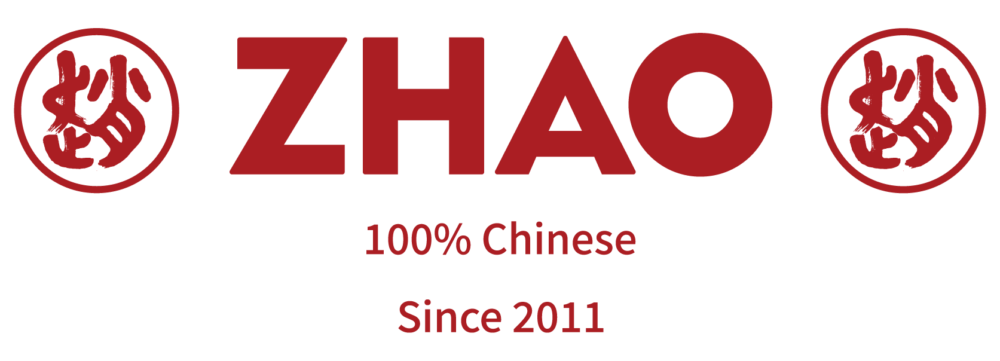
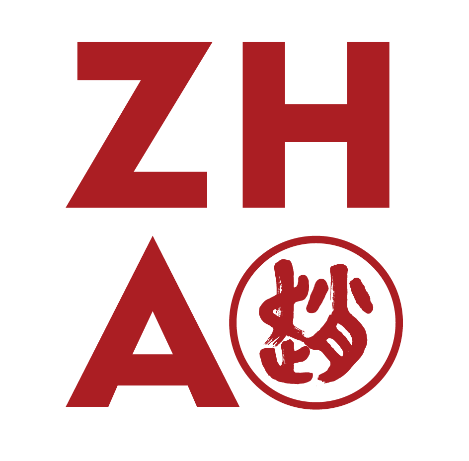

<p align="center">
  
</p>

<h1 align="center">ZHAO's Family — 赵</h1>

<p align="center">
  <strong>餐厅数字化运营与管理平台</strong>
  <br />
  Internal Restaurant Operations Platform
</p>

<p align="center">
  
</p>

<p align="center">
  — Since 2011 —
</p>

---

## Overview

ZHAO's Family is a full-stack monorepo powering the daily operations of the ZHAO restaurant group. It connects the **Next.js web dashboard** (for managers and office staff), an **Expo React Native mobile app** (for on-the-ground restaurant teams), and a **NestJS backend API** backed by MySQL.

The platform centralises purchasing, inventory, supplier management, staff training, recruitment, internal communication, and administrative workflows — replacing fragmented paper and spreadsheet processes with a unified digital system.

> **Tech stack**: Next.js 15 (App Router) · Expo React Native · NestJS · MySQL (Prisma ORM) · pnpm workspaces · TypeScript · Turborepo · Zustand · TanStack Query · Axios · MinIO (object storage) · Docker

---

## Brand Identity

ZHAO (赵 / ZHAO's) is a Chinese restaurant group established in 2011. The brand identity centres on traditional Chinese aesthetics expressed through red-and-white colour schemes, calligraphic typography, and cultural motifs. All platform surfaces — web, mobile, and print exports — carry this visual language consistently.

| Element | Detail |
|---|---|
| Brand name | ZHAO / ZHAO's Family / 赵 |
| Founded | 2011 |
| Primary colour | Chinese red (#CC0000) |
| Brand assets | `apps/web/public/logo2024/`, `apps/web/public/ZHAO-元素element/` |

---

## Architecture

```text
zhao-family/
├── apps/
│   ├── web/              Next.js dashboard (managers, office)
│   ├── mobile/           Expo React Native app (restaurant staff)
│   └── backend/          NestJS REST API + Prisma + MinIO
├── packages/
│   ├── api/              Shared Axios client, API modules, query keys
│   ├── auth/             Shared auth store & orchestration
│   ├── types/            Shared DTOs, API contracts, view-safe types
│   └── utils/            Pure utility functions
├── docker-compose.yml    MySQL 8.4 + MinIO
├── turbo.json            Turborepo task orchestration
└── pnpm-workspace.yaml   Monorepo workspace definition
```

### Design principles

- **Platform-separated UI**: Web and Mobile never share presentational components. Each targets its own device idiom and user role.
- **Shared logic via packages**: API clients, auth flows, DTOs, and utilities are shared through `packages/*` — ensuring backend contracts are typed end-to-end.
- **Thin controllers, rich services**: Backend controllers only parse requests and delegate; business logic lives in services.
- **RBAC**: Role-based access control is enforced at the API layer via reusable guards, with roles and permissions stored in the database.

---

## Features

### Purchasing & Supply Chain

| Feature | Description |
|---|---|
| **Purchase Orders** | Create, view, and manage supplier purchase orders with PDF generation |
| **Order History** | Browse and filter past orders across all restaurants |
| **Returns** | Log purchase returns with reason tracking and item-level photos |
| **Inventory** | Real-time inventory movement tracking with delta logging |
| **Suppliers** | Manage supplier catalogues, product references, and pricing |
| **Products** | Multi-currency, multi-specification product catalogue (Chinese/French) |

### Staff Management

| Feature | Description |
|---|---|
| **Authentication** | Email/password login with refresh token rotation and invite flows |
| **RBAC** | Granular role- and permission-based access control |
| **Profile** | Personal settings, language preferences (FR/CN), account management |
| **Recruitment** | Request and approve new hires by contract type and position |

### Training

| Feature | Description |
|---|---|
| **Materials Library** | Upload and organise training videos, PDFs, and images per position |
| **Training Space** | Staff consume assigned materials with progress tracking |
| **Progress Reporting** | Per-user, per-material completion status and scores |
| **Positions** | Hierarchical position catalogue with multi-language names (FR/CN/EN) |

### Internal Communication

| Feature | Description |
|---|---|
| **Dashboard Posts** | Company announcements, policy updates, and news with attachment support |
| **Targeted Visibility** | Posts can be scoped by role, restaurant, or employee level |

### Dashboard & Reporting

| Feature | Description |
|---|---|
| **Store Overview** | Per-restaurant dashboard with key metrics |
| **Dashboard News** | Integrated news feed from internal posts |

---

## Data Model (Core Entities)

```
Restaurant ──┬── User ──┬── UserRole ── Role ── RolePermission ── Permission
             │           └── RefreshSession
             ├── PurchaseOrder ── PurchaseOrderItem ── PurchaseReturnItem
             │                                       └── PurchaseReturn
             ├── DashboardPost
             └── RecruitmentRequest

Supplier ─── Product ─── InventoryMovement

TrainingPosition ─── TrainingMaterial ─── TrainingMaterialProgress
```

---

## Quick Start

### Prerequisites

- Node.js >= 20
- pnpm (enable via Corepack)
- Docker Desktop

```bash
# Enable pnpm with Corepack
corepack enable
corepack prepare pnpm@11.1.3 --activate

# Install dependencies
pnpm install
```

### Database

```bash
# Start MySQL and MinIO
pnpm db:up

# Generate Prisma client
pnpm db:generate

# (Optional) Run migrations and seed
pnpm db:migrate
pnpm db:seed
```

### Development

```bash
# Start everything (web + API in parallel)
pnpm dev

# Or start individually:
pnpm dev:web       # http://localhost:3000
pnpm dev:api       # http://localhost:3002/api
pnpm dev:mobile    # Expo development server
```

### Mobile builds

```bash
pnpm mobile:android    # Native Android build (requires JDK + Android Studio)
pnpm mobile:ios        # Native iOS build (requires Xcode + CocoaPods)
```

---

## Useful Commands

```bash
pnpm build              # Build all apps
pnpm build:web          # Build web only
pnpm build:api          # Build backend only
pnpm typecheck          # TypeScript check across the monorepo
pnpm lint               # ESLint across all packages
pnpm format             # Prettier formatting

# Database
pnpm db:pull            # Introspect existing DB into Prisma schema
pnpm db:push            # Push schema to DB without migration
pnpm db:seed            # Run seed script
pnpm db:logs            # Tail MySQL container logs

# Testing
pnpm --filter backend test          # Backend unit tests
pnpm --filter backend test:e2e      # Backend e2e tests
pnpm mobile:test                    # Mobile tests
pnpm mobile:lint                    # Mobile lint
```

---

## Local URLs

| Service | URL |
|---|---|
| Web dashboard | `http://localhost:3000` |
| Backend API | `http://localhost:3002/api` |
| Health check | `http://localhost:3002/api/health` |
| MinIO console | `http://localhost:9001` |
| MySQL CLI | `docker exec -it zhao-backend-mysql mysql -uzhao -pdev_pass zhao_family` |

---

## Environment Variables

Copy the example env files and fill in your local values:

```bash
cp apps/web/.env.example apps/web/.env
cp apps/backend/.env.example apps/backend/.env
cp apps/mobile/.env.example apps/mobile/.env
```

Key prefixes:
- `NEXT_PUBLIC_*` — Web client-side env vars
- `EXPO_PUBLIC_*` — Mobile client-side env vars

Do not commit `.env` files or production secrets.

---

## Architecture Rules

- **UI stays platform-specific**. Web and Mobile do not share components.
- **DTOs, API clients, auth, and utilities** are shared through `packages/*`.
- **Feature API calls** belong in package modules or feature services, not inside screens.
- **API responses** follow a consistent structure — success, error, and pagination patterns are uniform.
- **Backend controllers** remain thin; all business logic lives in services.
- **All external input** is validated via DTOs with `class-validator`.
- **MinIO** stores training materials, media assets, and document attachments.
- **Environment variables** are platform-specific by convention.

---

## Project Maturity

This monorepo represents a production-grade system actively used in restaurant operations. The codebase follows enterprise conventions:

- Strict TypeScript with no `any` abuse
- Modular NestJS architecture
- Comprehensive Prisma schema with indexed queries
- Jest-based testing on the backend (`*.spec.ts` + e2e)
- Mobile app with NativeWind styling and Expo Router navigation
- Turborepo caching for fast builds

---

## License

Private — internal use. ZHAO's Family (赵). All rights reserved.
