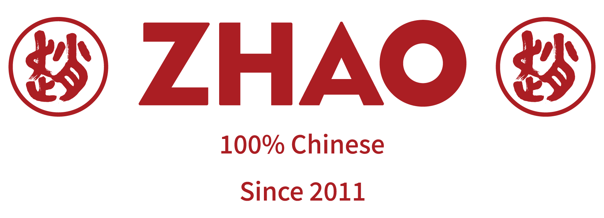

<p align="center">
  
</p>

<h1 align="center">ZHAO's Family — 赵</h1>

<p align="center">
  <strong>Plateforme de gestion et d'exploitation numérique pour la restauration</strong>
  <br />
  Internal Restaurant Operations Platform
</p>

<p align="center">
  
</p>

<p align="center">
  — Depuis 2011 —
</p>

---

## Vue d'ensemble

ZHAO's Family est un monorepo full-stack qui alimente les opérations quotidiennes du groupe de restaurants ZHAO. Il relie un **tableau de bord web Next.js** (pour les gestionnaires et le personnel administratif), une **application mobile Expo React Native** (pour les équipes en restaurant) et une **API backend NestJS** reposant sur MySQL.

La plateforme centralise les achats, les stocks, la gestion des fournisseurs, la formation du personnel, le recrutement, la communication interne et les flux administratifs — remplaçant les processus fragmentés sur papier et tableurs par un système numérique unifié.

> **Stack technique** : Next.js 15 (App Router) · Expo React Native · NestJS · MySQL (Prisma ORM) · pnpm workspaces · TypeScript · Turborepo · Zustand · TanStack Query · Axios · MinIO (stockage objet) · Docker

## Identité de marque

ZHAO (赵 / ZHAO's) est un groupe de restaurants chinois fondé en 2011. L'identité de marque s'articule autour de l'esthétique traditionnelle chinoise, exprimée par une palette rouge et blanc, une typographie calligraphique et des motifs culturels. Toutes les surfaces de la plateforme — web, mobile et exports papier — déclinent ce langage visuel de manière cohérente.

| Élément               | Détail                                                           |
| --------------------- | ---------------------------------------------------------------- |
| Nom de la marque      | ZHAO / ZHAO's Family / 赵                                        |
| Fondation             | 2011                                                             |
| Couleur principale    | Rouge chinois (#CC0000)                                          |
| Ressources graphiques | `apps/web/public/logo2024/`, `apps/web/public/ZHAO-元素element/` |

---

## Architecture

```text
zhao-family/
├── apps/
│   ├── web/              Dashboard Next.js (gestionnaires, bureau)
│   ├── mobile/           App Expo React Native (équipes restaurant)
│   └── backend/          API REST NestJS + Prisma + MinIO
├── packages/
│   ├── api/              Client Axios partagé, modules API, clés de requête
│   ├── auth/             Store d'authentification partagé et orchestration
│   ├── types/            DTOs partagés, contrats API, types sécurisés
│   └── utils/            Fonctions utilitaires pures
├── docker-compose.yml    Infrastructure locale : MySQL 8.4 + MinIO
├── docker-compose.backend.yml
│                          Exécution du backend de production dans Docker
├── .github/workflows/    CI et déploiements Web / Backend
├── turbo.json            Orchestration des tâches Turborepo
└── pnpm-workspace.yaml   Définition du workspace monorepo
```

### Principes de conception

- **UI séparée par plateforme** : Web et Mobile ne partagent jamais de composants d'interface. Chacun cible son propre terminal et son rôle utilisateur.
- **Logique partagée via packages** : Les clients API, les flux d'authentification, les DTOs et les utilitaires sont mutualisés dans `packages/*`, garantissant que les contrats backend sont typés de bout en bout.
- **Contrôleurs légers, services riches** : Les contrôleurs backend se contentent de parser les requêtes et de déléguer ; la logique métier réside dans les services.
- **RBAC** : Le contrôle d'accès basé sur les rôles est appliqué au niveau API via des guards réutilisables, les rôles et permissions étant stockés en base de données.

---

## Fonctionnalités

### Achats & Supply Chain

| Fonctionnalité               | Description                                                                        |
| ---------------------------- | ---------------------------------------------------------------------------------- |
| **Bons de commande**         | Créer, consulter et gérer les bons de commande fournisseurs avec génération PDF    |
| **Historique des commandes** | Parcourir et filtrer les commandes passées par restaurant                          |
| **Retours**                  | Enregistrer les retours fournisseurs avec suivi des motifs et photos par article   |
| **Stocks**                   | Suivi en temps réel des mouvements de stock avec journalisation des écarts         |
| **Fournisseurs**             | Gérer les catalogues fournisseurs, références produits et tarifs                   |
| **Produits**                 | Catalogue produits multi-spécifications et multi-devises (chinois/français)        |
| **Recettes**                 | Fiches recettes par poste, avec ingrédients, étapes, photos et contenu multilingue |

### Opérations en restaurant

| Fonctionnalité                    | Description                                                                                              |
| --------------------------------- | -------------------------------------------------------------------------------------------------------- |
| **Contrôles ABC**                 | Créer des campagnes de contrôle, noter chaque établissement, joindre des médias et publier les résultats |
| **Classement des établissements** | Consulter les grilles de notes et les cycles publiés par restaurant                                      |
| **File d'attente**                | Suivre les clients en attente et faire évoluer leur statut depuis l'établissement                        |

### Gestion du personnel

| Fonctionnalité             | Description                                                                              |
| -------------------------- | ---------------------------------------------------------------------------------------- |
| **Authentification**       | Connexion email/mot de passe avec rotation des refresh tokens et flux d'invitation       |
| **RBAC**                   | Contrôle d'accès granulaire basé sur les rôles et permissions                            |
| **Profil**                 | Paramètres personnels, préférences linguistiques (FR/CN), gestion du compte              |
| **Recrutement**            | Demander, traiter et archiver les recrutements par type de contrat et poste              |
| **Validation des comptes** | Gérer les invitations, réinitialisations de mot de passe et l'approbation des comptes    |
| **Notifications**          | Notifications internes, suivi des éléments non lus et enregistrement de tokens push Expo |

### Formation

| Fonctionnalité               | Description                                                                                        |
| ---------------------------- | -------------------------------------------------------------------------------------------------- |
| **Bibliothèque de matériel** | Téléverser et organiser vidéos, PDFs et images de formation par poste                              |
| **Parcours et progression**  | Les employés consultent leurs parcours, avec suivi de complétion et d'avancement par établissement |
| **Quiz**                     | Créer, administrer ou générer avec IA des quiz ; enregistrer les tentatives et scores              |
| **Badges et titres**         | Définir des conditions d'obtention, attribuer des titres et afficher les réussites des employés    |
| **Rapports mensuels**        | Suivre la progression de formation sur une période donnée                                          |
| **Postes**                   | Catalogue hiérarchique des postes avec noms multilingues (FR/CN/EN)                                |

### Communication interne

| Fonctionnalité                   | Description                                                                           |
| -------------------------------- | ------------------------------------------------------------------------------------- |
| **Publications tableau de bord** | Annonces d'entreprise, mises à jour des politiques et actualités avec pièces jointes  |
| **Visibilité ciblée**            | Les publications peuvent être restreintes par rôle, restaurant ou niveau hiérarchique |
| **Partage de cas**               | Publier des cas terrain, commenter, aimer et soumettre les contenus à validation      |

### Tableau de bord & Reporting

| Fonctionnalité         | Description                                                |
| ---------------------- | ---------------------------------------------------------- |
| **Vue par restaurant** | Tableau de bord par établissement avec indicateurs clés    |
| **Fil d'actualité**    | Flux d'actualités intégré depuis les publications internes |

---

## Modèle de données (Entités principales)

```
Restaurant ──┬── User ──┬── UserRole ── Role ── RolePermission ── Permission
             │           ├── RefreshSession / PushToken / Notification
             │           ├── TrainingMaterialProgress / TrainingQuizAttempt
             │           └── UserTrainingTitle / UserTrainingBadge
             ├── PurchaseOrder ── PurchaseOrderItem ── PurchaseReturnItem
             │                                       └── PurchaseReturn
             ├── AbcStoreInspection ── AbcInspectionMedia
             ├── CaseShare ── CaseShareComment / CaseShareLike
             └── WaitingQueueEntry

Supplier ─── Product ─── InventoryMovement

TrainingPosition ─── TrainingMaterial ── TrainingQuiz ── TrainingQuizQuestion
                       └─────────────── TrainingBadgeRequirement

Recipe ── RecipeIngredient / RecipeStep / RecipeJobRole
```

---

## Démarrage rapide

### Prérequis

- Node.js >= 20
- pnpm (activable via Corepack)
- Docker Desktop

```bash
# Activer la version du gestionnaire de paquets définie par le projet
corepack enable
corepack prepare pnpm@11.1.3 --activate

# Installer les dépendances
pnpm install
```

### Base de données

```bash
# Démarrer MySQL
pnpm db:up

# Démarrer MinIO, requis pour les fichiers, médias et pièces jointes
docker compose up -d minio

# Générer le client Prisma
pnpm db:generate

# Créer/appliquer les migrations de développement, puis charger les données initiales
pnpm db:migrate
pnpm db:seed
```

### Développement

```bash
# Tout démarrer (web + API en parallèle)
pnpm dev

# Ou séparément :
pnpm dev:web       # http://localhost:3000
pnpm dev:api       # http://localhost:3002/api
pnpm dev:mobile    # Serveur de développement Expo
```

### Builds mobiles

```bash
pnpm mobile:android    # Build natif Android (JDK + Android Studio requis)
pnpm mobile:ios        # Build natif iOS (Xcode + CocoaPods requis)
```

---

## Commandes utiles

```bash
pnpm build              # Builder toutes les apps
pnpm build:web          # Builder web uniquement
pnpm build:api          # Builder backend uniquement
pnpm typecheck          # Vérification TypeScript sur le monorepo
pnpm lint               # ESLint sur tous les packages
pnpm format             # Formatage Prettier
pnpm format:check       # Vérifier le formatage sans modifier les fichiers

# Base de données
pnpm db:pull            # Introspecter la BDD existante dans le schéma Prisma
pnpm db:push            # Pousser le schéma sans migration
pnpm db:seed            # Exécuter le script de seed
pnpm db:logs            # Suivre les logs du conteneur MySQL
pnpm db:down            # Arrêter l'infrastructure Docker locale

# Tests
pnpm --filter backend test          # Tests unitaires backend
pnpm --filter backend test:e2e      # Tests e2e backend
pnpm mobile:test                    # Tests mobile
pnpm mobile:lint                    # Lint mobile
```

---

## URLs locales

| Service        | URL                                                                      |
| -------------- | ------------------------------------------------------------------------ |
| Dashboard web  | `http://localhost:3000`                                                  |
| API backend    | `http://localhost:3002/api`                                              |
| Health check   | `http://localhost:3002/api/health`                                       |
| API MinIO (S3) | `http://localhost:9000`                                                  |
| Console MinIO  | `http://localhost:9001`                                                  |
| CLI MySQL      | `docker exec -it zhao-backend-mysql mysql -uzhao -pdev_pass zhao_family` |

---

## Variables d'environnement

Copier les fichiers d'exemple et renseigner vos valeurs locales :

```bash
cp apps/web/.env.example apps/web/.env
cp apps/backend/.env.example apps/backend/.env
cp apps/mobile/.env.example apps/mobile/.env
```

Préfixes clés :

- `NEXT_PUBLIC_*` — Variables d'environnement côté client web
- `EXPO_PUBLIC_*` — Variables d'environnement côté client mobile
- `AI_*` — Configuration facultative de génération de quiz (backend)
- `MINIO_*` — Stockage compatible S3 : MinIO en local, Cloudflare R2 en production

Pour le mobile sur appareil physique, remplacez l'URL d'exemple par l'adresse LAN accessible de votre API. Ne pas commiter les fichiers `.env` ni les secrets de production.

---

## Règles d'architecture

- **L'UI reste spécifique à chaque plateforme** : Web et Mobile ne partagent pas de composants.
- **Les DTOs, clients API, auth et utilitaires** sont mutualisés dans `packages/*`.
- **Les appels API fonctionnels** appartiennent aux modules de package ou aux services fonctionnels, pas aux écrans.
- **Les réponses API** suivent une structure cohérente — les motifs succès, erreur et pagination sont uniformes.
- **Les contrôleurs backend** restent légers ; toute la logique métier réside dans les services.
- **Toute entrée externe** est validée via les DTOs avec `class-validator`.
- **MinIO** stocke les supports de formation, les ressources média et les pièces jointes.
- **Les endpoints API** sont protégés par une authentification par token, des guards RBAC et une limitation de débit globale.
- **Helmet, CORS et les limites de requête** sont configurés au démarrage du backend.
- **Les variables d'environnement** sont spécifiques à chaque plateforme par convention.

---

## CI/CD et exploitation

- La CI GitHub Actions exécute le lint, le contrôle de types, les builds, les tests unitaires backend et les tests mobiles sur les pull requests et `main`.
- Le dashboard web est exporté statiquement puis déployé par SFTP lors des modifications Web concernées sur `main`.
- Le backend est construit en image Docker publiée dans GHCR et déployé manuellement avec une vérification de migration et de santé.

## Qualité et couverture

Le monorepo s'appuie sur les contrôles suivants :

- Contrôles TypeScript, ESLint et Prettier au niveau du workspace
- Tests Jest unitaires backend et tests e2e disponibles dans `apps/backend/test`
- Tests Jest mobiles
- Validation des entrées NestJS, tests des guards et tests des services ciblés
- Cache Turborepo pour l'orchestration des tâches

---

## Licence

Privé — usage interne. ZHAO's Family (赵). Tous droits réservés.
