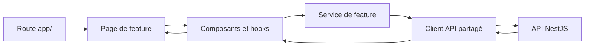

# Guide technique du frontend Web

> Référence d'onboarding pour les équipes techniques et produit qui contribuent au
> tableau de bord web de ZHAO's Family.

## 1. Objet et périmètre

Le frontend web se trouve dans [`apps/web`](../apps/web). C'est le tableau de
bord interne utilisé par les équipes de magasin, les responsables régionaux et
le siège pour gérer les opérations du groupe : formation, commandes,
fournisseurs, magasins, recrutement, stocks et administration.

Ce guide décrit le fonctionnement du dashboard, son organisation et les règles
à respecter pour le faire évoluer. Il ne remplace pas :

- la documentation générale du monorepo dans [`README.md`](../README.md) ;
- la documentation de déploiement dans [`docs/deployment.md`](deployment.md) ;
- les règles de contribution détaillées dans
  [`apps/web/FRONTEND_STANDARDS.md`](../apps/web/FRONTEND_STANDARDS.md).

### Frontières du frontend

| Élément | Responsabilité |
| --- | --- |
| `apps/web` | Interface web, navigation, état d'interface, appels HTTP et expérience utilisateur. |
| `apps/mobile` | Application Expo React Native destinée aux équipes terrain ; elle ne partage pas les composants visuels du web. |
| `apps/backend` | API REST NestJS, règles métier, persistance et autorisation finale. |
| `packages/api` | Client HTTP partagé, gestion des jetons et primitives d'accès à l'API. |
| `packages/auth`, `packages/types`, `packages/utils` | Capacités et contrats réutilisables entre applications. |

Le frontend ne doit ni contenir de logique métier faisant autorité, ni accéder à
la base de données. Il présente les données et orchestre les interactions avec
l'API.

## 2. Stack et principes techniques

| Domaine | Choix actuel | Usage |
| --- | --- | --- |
| Framework | Next.js 15, App Router | Routage, layouts et production du site web. |
| Interface | React 19, composants fonctionnels | Composition des pages et interactions. |
| Langage | TypeScript, avec migration progressive de fichiers JavaScript historiques | Nouveaux fichiers en `.ts` ou `.tsx` ; types explicites aux frontières. |
| Données serveur | TanStack Query | Cache et cycle de vie des requêtes dans les composants qui l'emploient. |
| État local partagé | Zustand | État local de feature lorsque ce choix est déjà adapté au domaine. |
| HTTP | `@zhao/api` et Axios | Authentification, renouvellement des jetons et appels vers l'API. |
| Styles | CSS Modules et CSS global | Styles encapsulés par feature et fondations globales. |
| Animation | Motion | Animations ponctuelles et légères, notamment dans la navigation. |

Le projet est exporté statiquement par Next.js (`output: "export"`) et utilise
`reactStrictMode`. Les routes, métadonnées et layouts doivent donc rester
compatibles avec ce mode de publication.

## 3. Architecture

### Organisation des dossiers

```text
apps/web/
├── app/                         # Routes Next.js, layouts et providers
├── components/                  # Composants globaux historiques
├── public/                      # Images, logos et ressources statiques
├── scripts/                     # Contrôles de qualité locaux
└── src/
    ├── features/                # Domaines métier autonomes
    │   └── <feature>/
    │       ├── pages/           # Composition des écrans
    │       ├── components/      # Interface propre au domaine
    │       ├── hooks/           # État et effets propres au domaine
    │       ├── services/        # Appels API et transformation des données
    │       ├── constants/       # Textes et valeurs métier statiques
    │       ├── types/           # Types du domaine
    │       └── utils/           # Fonctions pures
    ├── shared/                  # Capacités réutilisées par plusieurs features
    │   ├── api/
    │   ├── components/
    │   ├── constants/
    │   ├── hooks/
    │   └── utils/
    ├── data/                    # Catalogues et données de référence
    └── types/                   # Types transverses
```

`app/**/page.*` est une entrée de route volontairement légère : elle monte une
page située dans la feature. Les règles métier, le chargement de données et la
composition d'interface ne doivent pas s'accumuler dans ce fichier de route.

### Flux de données attendu



Règles essentielles :

- une page orchestre ; un composant de présentation ne lance pas directement
  une requête ;
- un service possède l'endpoint, les paramètres et la conversion du résultat ;
- un service ne contient ni texte d'interface ni appel à un setter React ;
- une fonction pure va dans `utils/`, sans réseau ni écriture d'état ;
- une capacité utilisée par au moins deux features appartient à `shared/`.

## 4. Fondations transverses

### Layouts et providers

Le layout racine charge les styles globaux, la typographie et les providers
applicatifs. `AppProviders` installe, dans cet ordre, le client TanStack Query,
le système de confirmation et les notifications toast. `AuthProvider` entoure
ensuite l'application et expose la session au travers de `useAuth`.

Toutes les routes sous `/dashboard/**` passent par `RequireAuth`. Pendant le
chargement de session, l'écran attend ; sans utilisateur authentifié, le client
redirige vers `/`.

### Authentification et session

`AuthContext` centralise la session et les actions associées : connexion,
inscription, déconnexion, mise à jour du profil, changement et réinitialisation
de mot de passe, suppression de compte et acceptation d'invitation.

Après une connexion, les jetons d'accès et de rafraîchissement sont conservés
dans `localStorage` lorsque l'option « se souvenir de cet appareil » est active,
sinon dans `sessionStorage`. Au démarrage, le contexte recharge les jetons puis
appelle `/auth/me`. En cas d'échec, il efface la session locale. Aucun nouveau
stockage de secret ne doit être ajouté sans revue de sécurité.

### Client API et médias

Le point d'accès standard est `src/shared/api/api-client.ts`. Il configure le
client issu de `@zhao/api`, fournit les jetons au client HTTP et exporte les
fonctions de résolution d'URL d'images et de médias signés.

Les URLs présignées sont préférables pour les médias privés : elles évitent de
placer le jeton de session dans l'URL. Les pages et composants ne doivent pas
créer de `fetch` isolé ni embarquer une URL d'API en dur.

### Langues et navigation

La navigation et de nombreux textes fournissent des variantes chinoise,
anglaise et française. `usePreferredLanguage` mémorise la langue choisie dans
le navigateur sous la clé existante `zhao_preferred_language`.

Les entrées de navigation sont déclarées dans
`features/dashboard/constants/dashboard-copy.js`. Elles peuvent être filtrées
par rôle métier ou permission avec `canSeeNavEntry`. Ce filtrage améliore
l'expérience et évite de proposer une action inaccessible ; il ne remplace
jamais le contrôle d'accès de l'API, qui reste l'autorité finale.

### Alias TypeScript

Les imports utilisent les alias suivants définis dans `apps/web/tsconfig.json` :

| Alias | Destination |
| --- | --- |
| `@/*` | `apps/web/src/*` et racine de l'application web |
| `@features/*` | `apps/web/src/features/*` |
| `@shared/*` | `apps/web/src/shared/*` |
| `@zhao/api`, `@zhao/auth`, `@zhao/types`, `@zhao/utils` | Sources des packages partagés du monorepo |

## 5. Routes et modules métier

Les chemins ci-dessous décrivent les routes présentes dans `apps/web/app`. La
visibilité effective dépend de l'authentification, du rôle et, selon le module,
des permissions retournées par l'API.

| Domaine | Routes principales | Fonction |
| --- | --- | --- |
| Accès et compte | `/`, `/reset-password`, `/accept-invitation`, `/delete-account`, `/privacy`, `/privacy-policy`, `/support` | Connexion, inscription, invitation, récupération d'accès, compte et informations légales. |
| Tableau de bord | `/dashboard` | Accueil opérationnel, informations internes et raccourcis de navigation. |
| Profil | `/dashboard/profile` | Consultation et mise à jour des informations de l'utilisateur. |
| Formation | `/dashboard/training`, `/dashboard/training/[id]`, `/dashboard/training/materials`, `/dashboard/training/materials/player`, `/dashboard/training/upload` | Espace de formation, consultation de cours et de ressources, lecteur de média et gestion des téléversements. |
| Certifications et titres | `/dashboard/training/certifications`, `/dashboard/training/titles`, `/dashboard/titles` | Badges/certifications, attribution de titres de formation et page de démonstration de titres. |
| Pilotage de la formation | `/dashboard/training/progress`, `/dashboard/training/reports/monthly`, `/dashboard/training/positions`, `/dashboard/training/permissions` | Suivi des progrès, rapport mensuel, gestion des postes et point d'accès aux permissions de formation. |
| Commandes | `/dashboard/orders/new`, `/dashboard/orders`, `/dashboard/orders/stats` | Création de commande, historique et statistiques produits. |
| Fournisseurs | `/dashboard/suppliers` | Liste, détail, catalogue et produits des fournisseurs. |
| Magasins | `/dashboard/stores`, `/dashboard/stores/[storeId]` | Gestion des établissements et consultation/validation d'un magasin ciblé. |
| Recrutement | `/dashboard/recruitment-requests` | Demandes de recrutement des magasins et bureau de traitement siège selon les droits. |
| Stocks | `/dashboard/inventory` | Stock et mouvements du ZHAO Bureau. |
| Gouvernance | `/dashboard/permissions`, `/dashboard/abc-scores`, `/dashboard/case-shares-review` | Rôles système, notation ABC des magasins et validation des partages de cas. |
| Fonctions spécialisées | `/dashboard/recipes`, `/dashboard/screen-security` | Gestion des recettes et audit de sécurité d'écran. |

Les routes `/dashboard/training/resources` et `/dashboard/training/topics` sont
également présentes comme entrées de navigation ou de compatibilité. Avant de
les faire évoluer, vérifier leur page et leur cible métier plutôt que de créer
un second parcours similaire.

## 6. Règles de contribution

### Types et JavaScript

- Tout nouveau code applicatif utilise TypeScript.
- Les fonctions exportées, services et retours de hooks déclarent un type de
  retour explicite.
- Préférer `unknown` avec resserrement de type à `any`.
- Les structures d'API, DTO et modèles de vue restent distincts : une page ne
  dépend pas directement d'une entité interne du backend.
- Exprimer explicitement les valeurs nulles (`string | null`) ; éviter les
  assertions `as` larges.
- Lors d'une modification importante d'un fichier JavaScript historique,
  privilégier une migration locale vers TypeScript, sans réécriture hors sujet.

### Composants, hooks et état

- Utiliser uniquement des composants fonctionnels, de responsabilité limitée.
- Garder les calculs et conditions complexes hors du JSX ; employer des clés
  stables dans toutes les listes.
- Les handlers portent un nom métier, par exemple `handleCreateSupplier` ; les
  conversions sont nommées `build…`, les validations `validate…` et les
  lectures `fetch…`.
- Un hook commence par `use`, traite une seule capacité et déclare des
  dépendances complètes dans ses effets.
- Gérer l'annulation, la concurrence et le démontage pour les effets
  asynchrones.
- Garder l'état d'interface dans le composant ; ne promouvoir l'état dans un
  hook, un store ou un contexte que s'il est réellement partagé.

### Services, états d'écran et erreurs

- Tous les appels réseau passent par un service de feature ou le client API
  partagé. Les téléversements utilisent `apiClient.upload`.
- Chaque écran exposé à l'utilisateur prévoit les états `loading`, vide,
  erreur, succès et refus de permission lorsque celui-ci est applicable.
- Ne jamais laisser un `catch` vide ni exposer directement à l'utilisateur un
  jeton, une pile d'exécution, une requête SQL ou un chemin serveur.
- Les paramètres de requête sont construits avec `URLSearchParams` quand cela
  rend le contrat explicite.

### Styles, accessibilité et performance

- Préférer un fichier `*.module.css` au sein de la feature ; réserver les
  styles globaux aux fondations de l'application.
- Réutiliser les couleurs, espacements, tailles et composants existants plutôt
  que créer des variantes isolées ou de grands blocs de styles inline.
- Prioriser la lisibilité et la densité d'information d'un outil interne. Les
  libellés et valeurs ne doivent jamais déborder des boutons, cartes ou cellules.
- Vérifier le rendu desktop et mobile. Les images et listes longues doivent
  avoir des dimensions, clés et stratégies de chargement adaptées.
- N'ajouter `useMemo` ou `useCallback` qu'après avoir identifié un calcul ou un
  rendu coûteux ; les animations doivent rester secondaires aux opérations
  métier.

### Sécurité et périmètre des changements

- Ne jamais versionner de secret, mot de passe, jeton ou adresse de production.
- Ne pas journaliser de données personnelles, de permissions détaillées ou de
  réponse d'erreur sensible.
- Toute évolution d'authentification, de médias, de téléchargement ou de
  permission doit être revue avec prudence côté frontend **et** backend.
- Ne pas ajouter de dépendance, modifier la CI, le déploiement ou une variable
  d'environnement sans besoin explicite et vérifié.

## 7. Démarrage local et validation

### Prérequis

- Node.js 20 ou supérieur ;
- pnpm 11.1.3 (version déclarée par le monorepo) ;
- API backend et ses dépendances disponibles lorsque l'on teste des données
  réelles.

### Installation et configuration

Depuis la racine du dépôt :

```bash
corepack enable
corepack prepare pnpm@11.1.3 --activate
pnpm install
cp apps/web/.env.example apps/web/.env.local
```

Le fichier d'exemple fournit :

```dotenv
NEXT_PUBLIC_API_BASE_URL=http://localhost:3002/api
```

Le client utilise d'abord `NEXT_PUBLIC_API_BASE_URL`, puis accepte
`NEXT_PUBLIC_API_URL` comme repli de compatibilité. Ces valeurs sont publiques
par conception car elles sont injectées dans le navigateur : elles ne doivent
jamais contenir de secret.

### Commandes utiles

```bash
# Développement du frontend seulement
pnpm dev:web

# Développement de toutes les applications du monorepo
pnpm dev

# Contrôles du frontend
pnpm --filter @zhao/web typecheck
pnpm --filter @zhao/web lint
pnpm --filter @zhao/web build

# Équivalents raccourcis depuis la racine
pnpm build:web
```

Le serveur web de développement écoute normalement sur `http://localhost:3000`.
L'API locale par défaut est `http://localhost:3002/api`.

Avant de livrer une modification, exécuter les contrôles pertinents et vérifier
manuellement le parcours modifié avec le rôle adéquat, y compris les états de
chargement, vide, erreur et permission.

## 8. Maintenance connue et priorités de qualité

Le frontend est en migration progressive : une partie du code historique reste
en JavaScript alors que les nouvelles surfaces utilisent TypeScript. Cette
situation est admise temporairement ; une contribution ne doit toutefois pas
mélanger une migration massive, du formatage global et une évolution métier.

Plusieurs modules et feuilles de styles historiques sont volumineux. Lorsqu'un
fichier devient difficile à comprendre ou dépasse les seuils de la convention,
extraire d'abord un sous-composant de présentation, un hook, un service, un type
ou une fonction pure selon la responsabilité identifiée. Ne pas découper
mécaniquement un fichier uniquement pour réduire son nombre de lignes.

Il n'existe actuellement pas de suite de tests automatisés dédiée à `apps/web`.
Pour toute évolution de logique, prioriser au minimum le typecheck, le lint et
le build, puis une vérification manuelle ciblée. Les futurs tests doivent se
concentrer sur les parcours à risque : connexion, visibilité par permission,
commande, fournisseurs, gestion des ressources de formation et états d'écran.

## 9. Checklist de contribution

Avant une revue, confirmer :

- [ ] La route ne fait que monter une page de feature.
- [ ] La responsabilité du composant, hook, service ou utilitaire est claire.
- [ ] L'appel API est centralisé et son contrat est typé.
- [ ] Les états de l'écran, les erreurs et les permissions sont visibles et sûrs.
- [ ] Les styles suivent les conventions existantes et restent utilisables sur
      petit écran.
- [ ] Aucun secret, log de débogage ou changement hors périmètre n'a été ajouté.
- [ ] Les vérifications exécutées et leurs résultats sont consignés avec la
      livraison.
